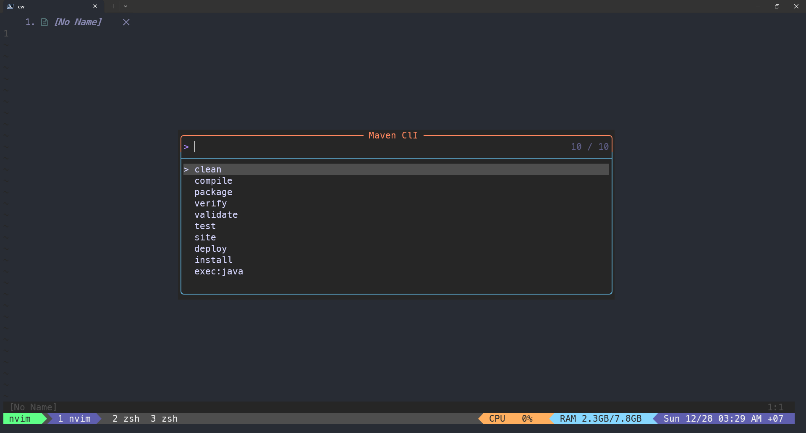
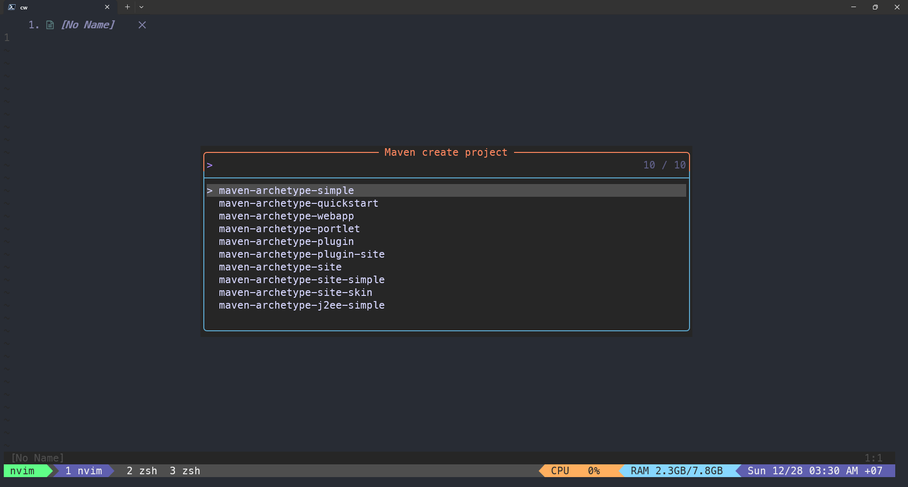
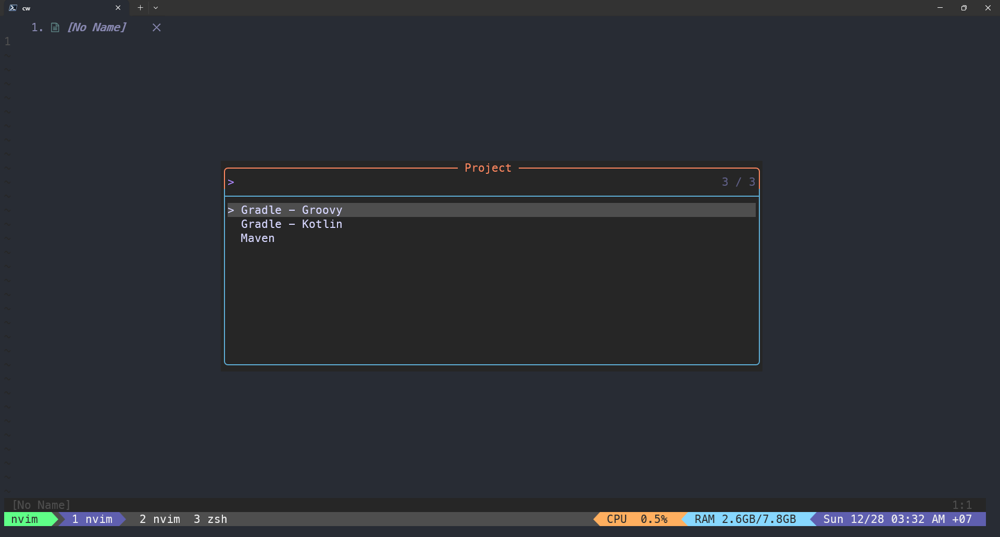

# Maven.nvim

This is neovim plugin for running maven command.





## Features

- [x] Run Maven CLI (e.g. clean, compile, test, ...)
- [x] Create maven project command
- [x] Create spring boot project
- [ ] Run java application
- [ ] Add spring boot dependencies to pom.xml
- [ ] Add maven dependencies from maven repository to pom.xml

## Requirement

- Neovim 0.11.0+
- curl 7.73+
- [telescope.nvim](https://github.com/nvim-telescope/telescope.nvim)
- mvn command in your `PATH` env

## Installation

### Lazy

```lua
{
    "https://github.com/yonchando/maven.nvim",
    dependencies = {
        {"nvim-telescope/telescope.nvim"},
    }
}
```

## Usage

#### Commands

`:MavenCLI` maven command to execute

`:MavenNewProject` to generate `archetype:generate`

`:SpringBootStarter` to create spring boot application

#### Keymapping

`<Tab>` to select multiple MavenCLI to run at once
